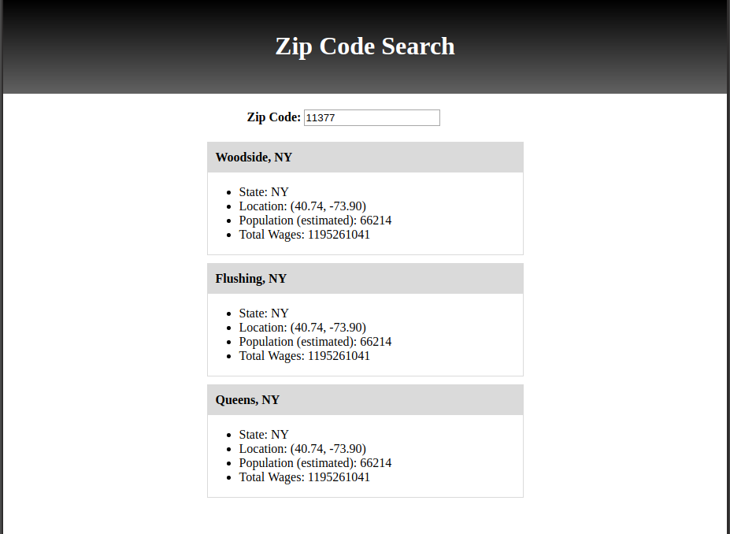

# Zip Code Search

This repository is the solution to the [CUNY Tech Prep week 3 in-class project 1](https://github.com/CUNYTechPrep/week-03-projects). The code here implements a simple React application that allows a user to get information about a zone within the United States based on the provided ZIP code. The application shows all information associated with the specified ZIP code. The figure below illustrates the output generated by the application for ZIP code '11377'.  

